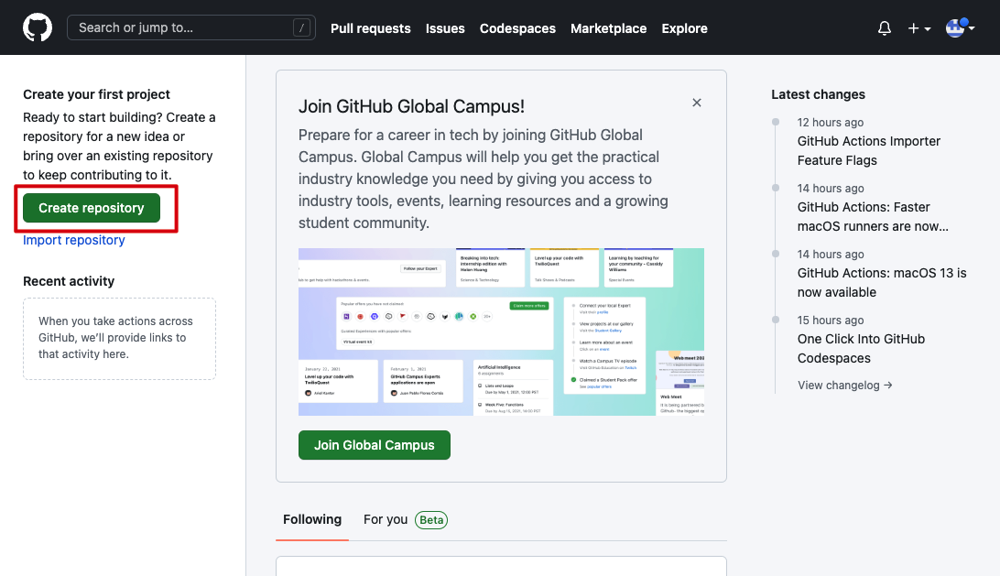
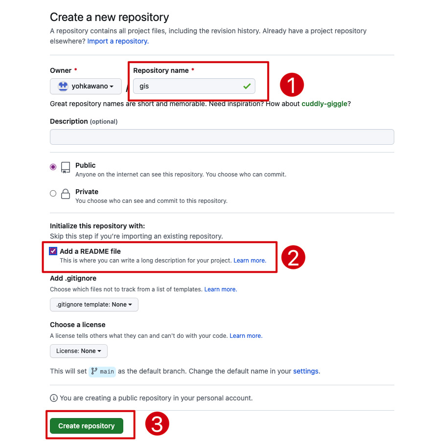
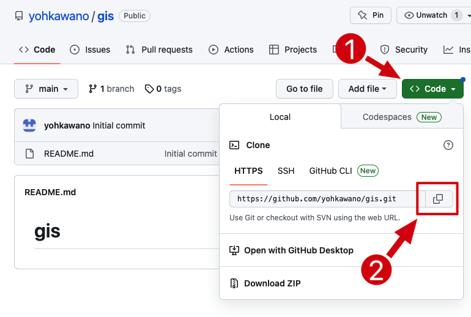
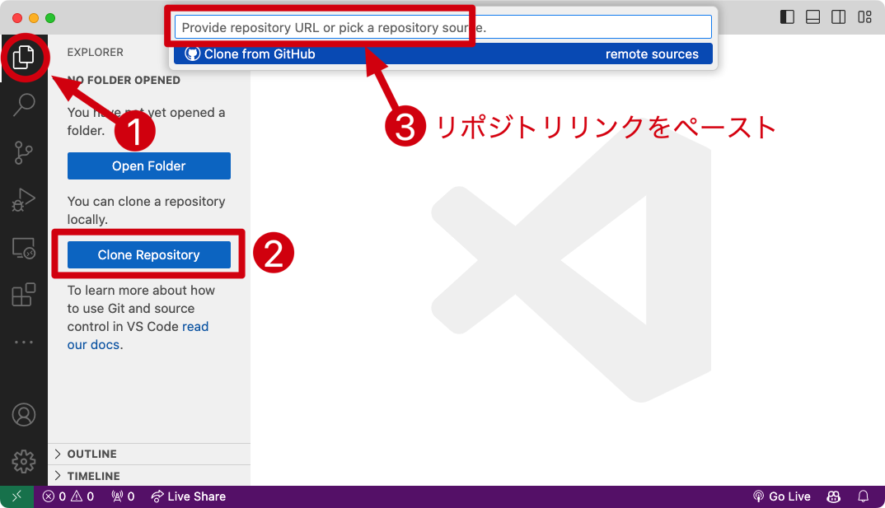
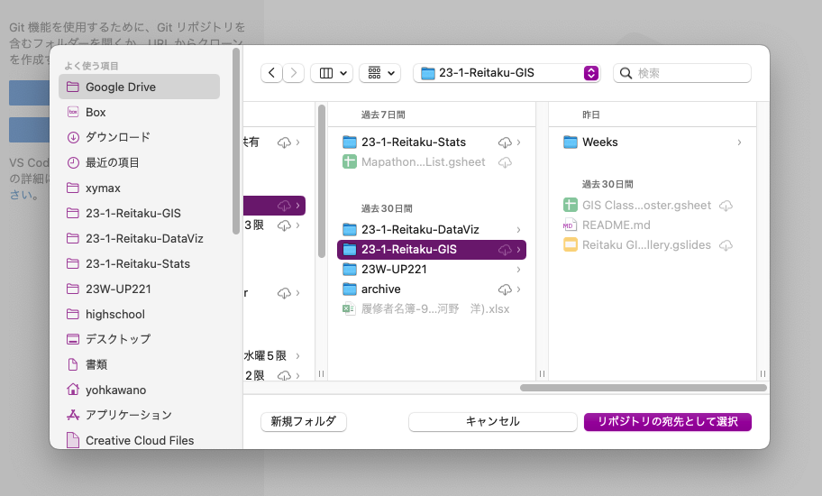
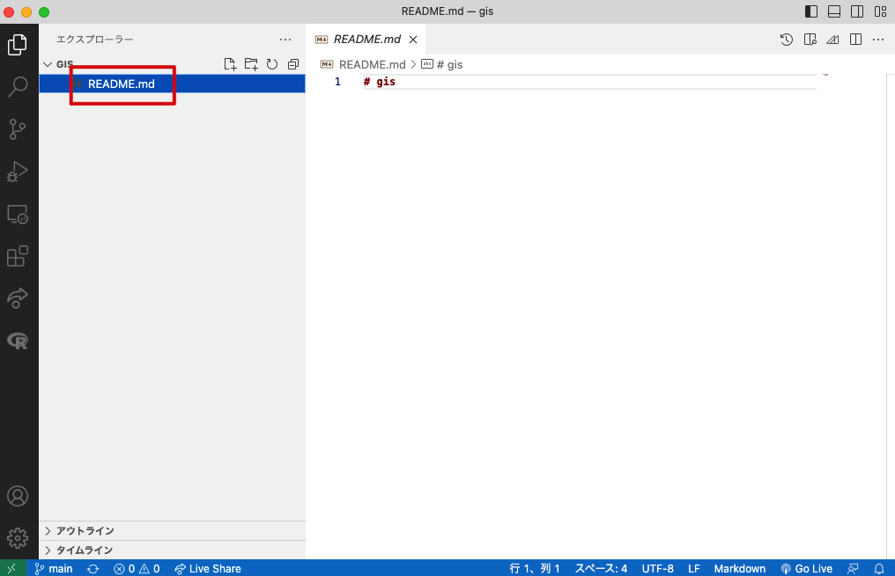
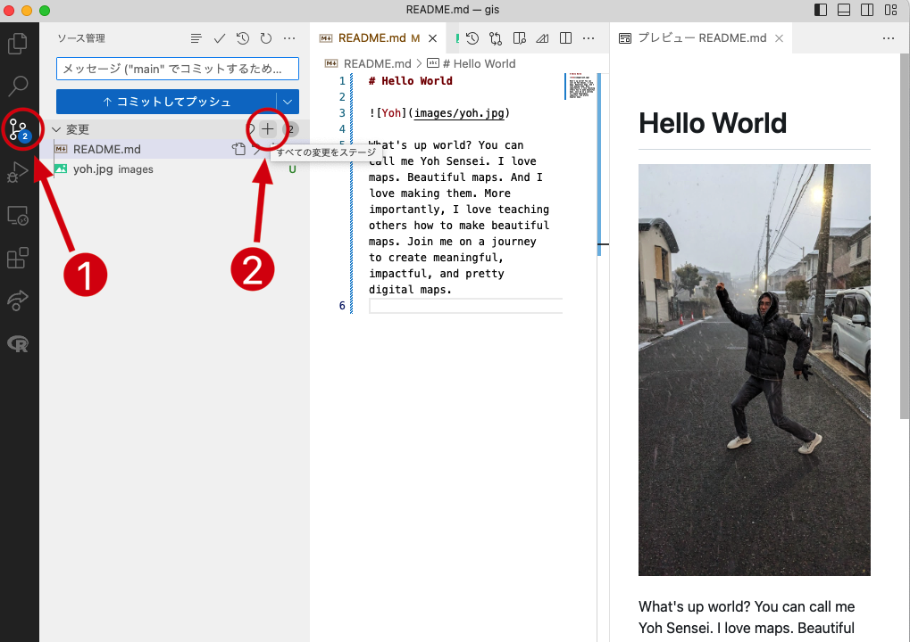
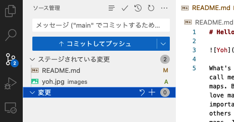
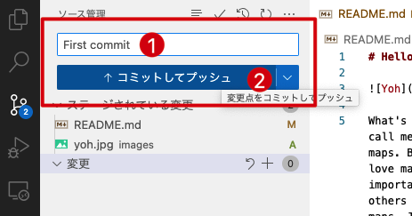

<style>
small {font-size:0.8em}
medium {font-size:1.6em}
large {font-size:3.5em}
xlarge {font-size:4em}
gray {padding:20px;background-color:whitesmoke;font-weight:1200;line-height:2.5}
red {color:red;font-weight:500;}
plum {padding:5px;background-color:plum;line-height:1.5;font-weight:300; font-size:1.5em}
t1 { font-size:4em;font-weight:100;line-height:1}
xl { font-size:2.5em;font-weight:100;line-height:1}
h2 { font-size:1.8em;font-weight:300;line-height:1}
xls { font-size:1.5em;font-weight:100;line-height:1}
h1,h2,h3,h4,h5{}
section {font-size:2em;font-weight:300;}
left {text-align:left;}
latex {font-size:2em;color:#444;line-height:1;font-weight:lighter}

hr {background-color:gray;width:80%;margin-top:40px;margin-bottom:40px;}

.small {font-size:0.6em}
.large {font-size:2em}
.gray {padding:20px;background-color:whitesmoke;}
.plum {padding:15px;background-color:plum;}
</style>

## GitHub & VSCode

<hr>


## 

① VSCodeインストール

<medium>☞ https://code.visualstudio.com/</medium>

<hr>

② GitHubアカウントを作る


<medium>☞ http://github.com</medium>


## アカウントを確認し、ログインできたら<br><plum>リポジトリ</plum><br>を作ろう

<hr>

リポジトリって何?

- 自分で検索してresearch! <medium>🤓</medium>


## ログインして「Create repository」

*すでにアカウント持っている人は「Repositories」→ 「New」



## 

<plum>gis</plum>と名付けよう



## VSCodeとGitHubを連携

<medium>☞</medium> 初期設定なので一回やればもうやらなくていい

##

VSCodeの中でTerminalを立ち上げる


##

あなたのusernameで次のコマンドを打ち込む

```
git config --global user.name "yohman"
```


##

あなたのemailで次のコマンドを打ち込む

```
git config --global user.email "ykawano@reitaku-u.ac.jp"
```


# GISリポジトリをGitHubから<br>VSCodeに<plum>クローン</plum>しよう

##


## GitHubでリポジトリのリンクをコピー



## VSCodeでリポジトリをクローン（コピー）する



## 自分のパソコンの覚えやすいところに保存



## README.md　ファイルを編集しよう



## Markdownで自己紹介


##

え？Markdownって何？

グーグルで検索！

例えば：

https://notepm.jp/help/how-to-markdown

## Challenge問題

自分の写真を載せよう


## GitHubに<plum>コミット</plum>しよう

1. 「ソース管理」タブをクリック
1. 「変更」の隣のプラスボタンをクリック



##

「ステージされている変更」にファイルが入っていることを確認



##

1. コメントを記入（とりあえず「First commit」と入力）
1. 「コミットしてプッシュボタン」をクリック





##

😫　エラーがある　➽　多半数
<hr>

👽　エラーがない　➽　あなたは天才

##

エラーがなければGitHubページに戻ってrefresh!


## エラーがあれば一緒に解決しょう

