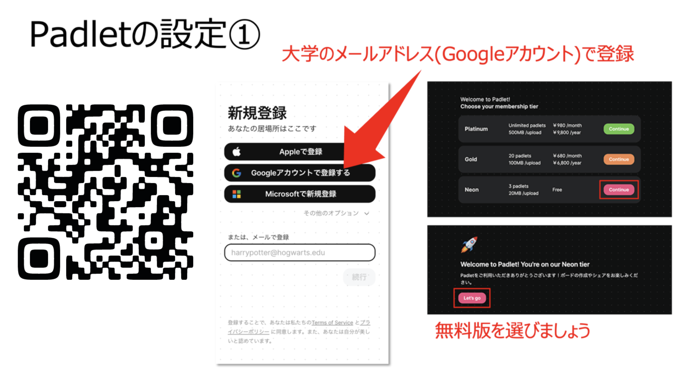
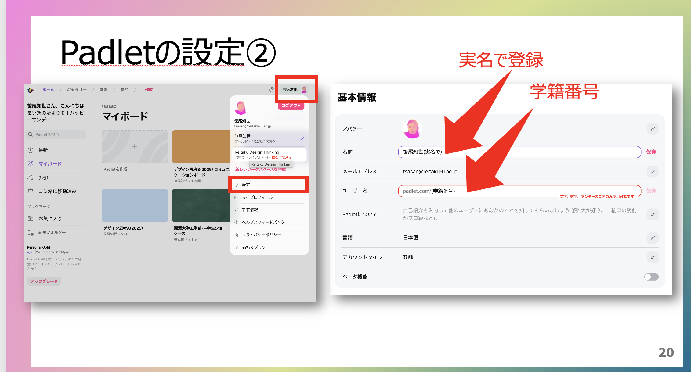
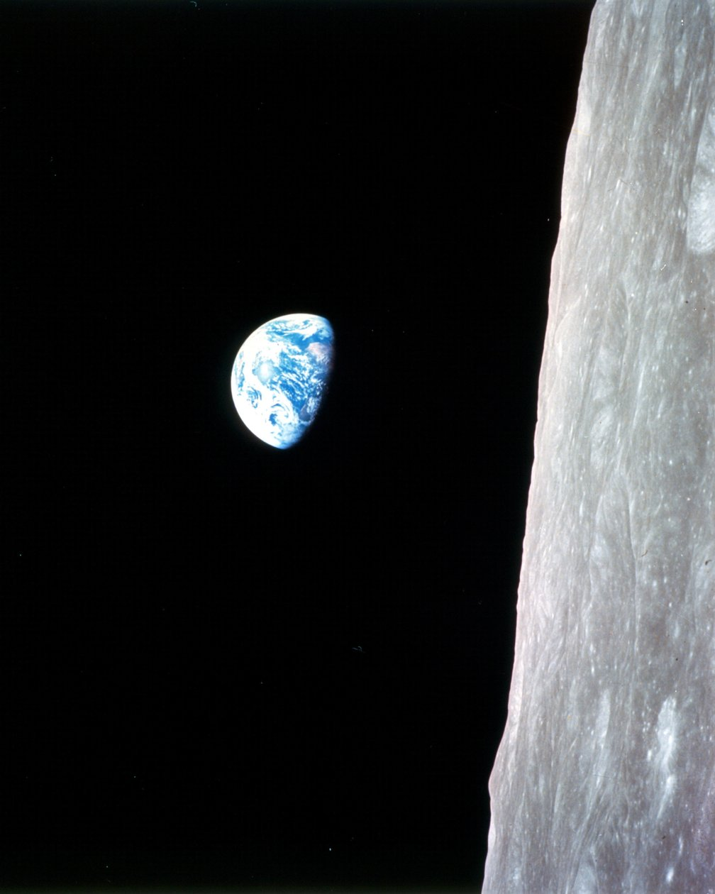
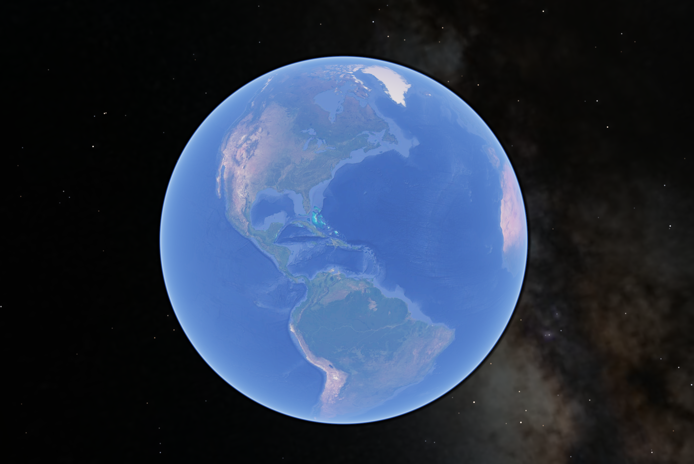
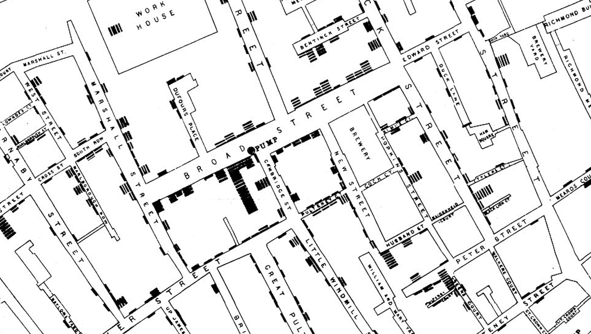
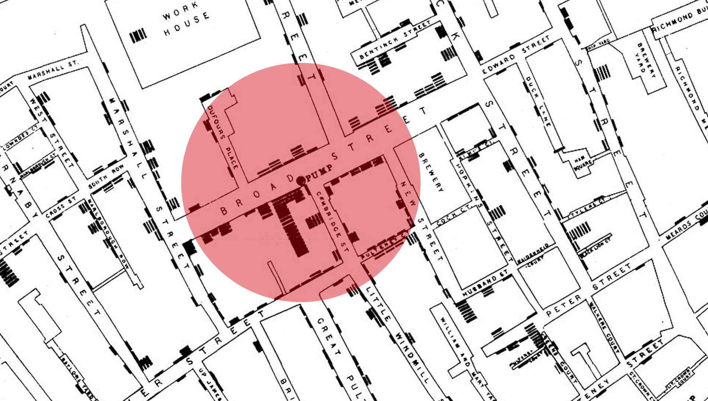
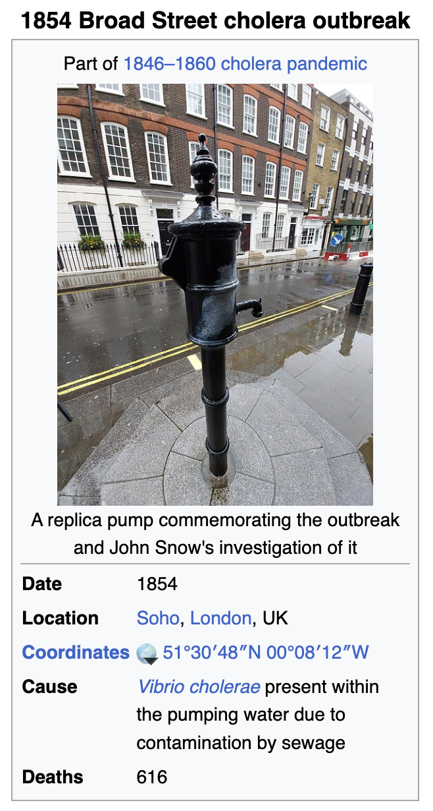
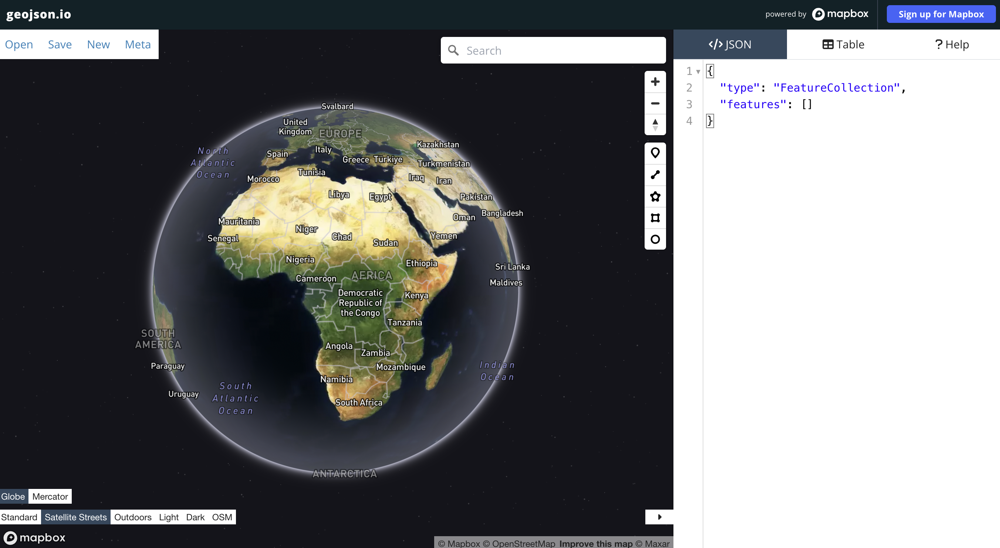

#

<h1 align="center">🌏 パドレットに自己紹介を投稿しよう！🌏</h1>

https://padlet.com/referrals/yohda

#

# Join the class padlet

https://padlet.com/yohda/gis

## 

Call me <large>Yoh</large>

In this class, we will call each other by <medium>first name 😙</medium>

# syllabus

[syllabus](<../../gis syllabus.pdf>)

#

[Class survey](https://forms.gle/qC2jjqToTcwtdWRr7)

# Earthrise
Apollo 8, December 24, 1968
#

#
“We came all this way to explore the Moon, and the most important thing we discovered was the Earth.” — William Anders

# The Blue Marble

Apollo 17 in December 1972

#

# Google Earth

#

#

https://www.google.com/earth/versions/#earth-pro

#

#

#

#

#

##
<xl>
Layers
</xl>

##

##

GISは<large>「ベースマップ」</large>から

##

#

https://maps.gsi.go.jp/

#

まずは<large>Web Development</large>から

[Lab 1](<../../labs/lab1 hello world.md>)

# 

For this class, all assignments will be created in <large>VSCode</large>

[Lab 2](../../labs/lab2_git_github_setup_jp.md)

#

