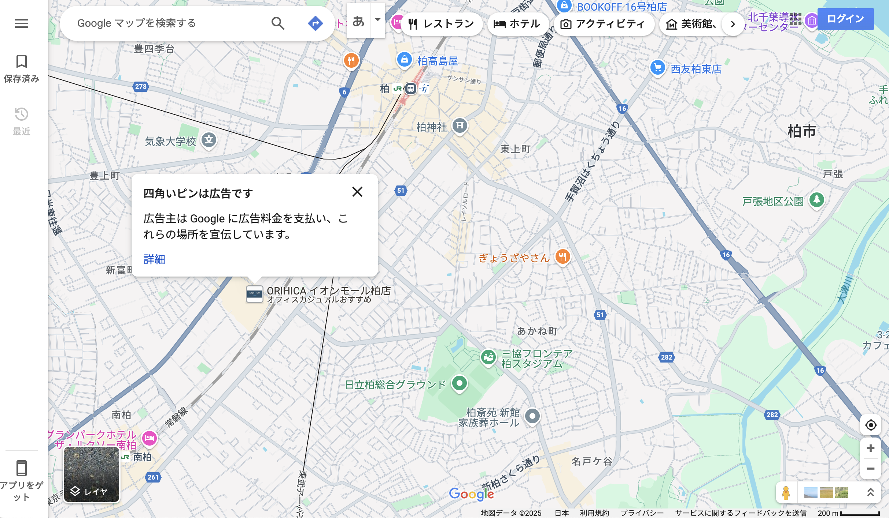
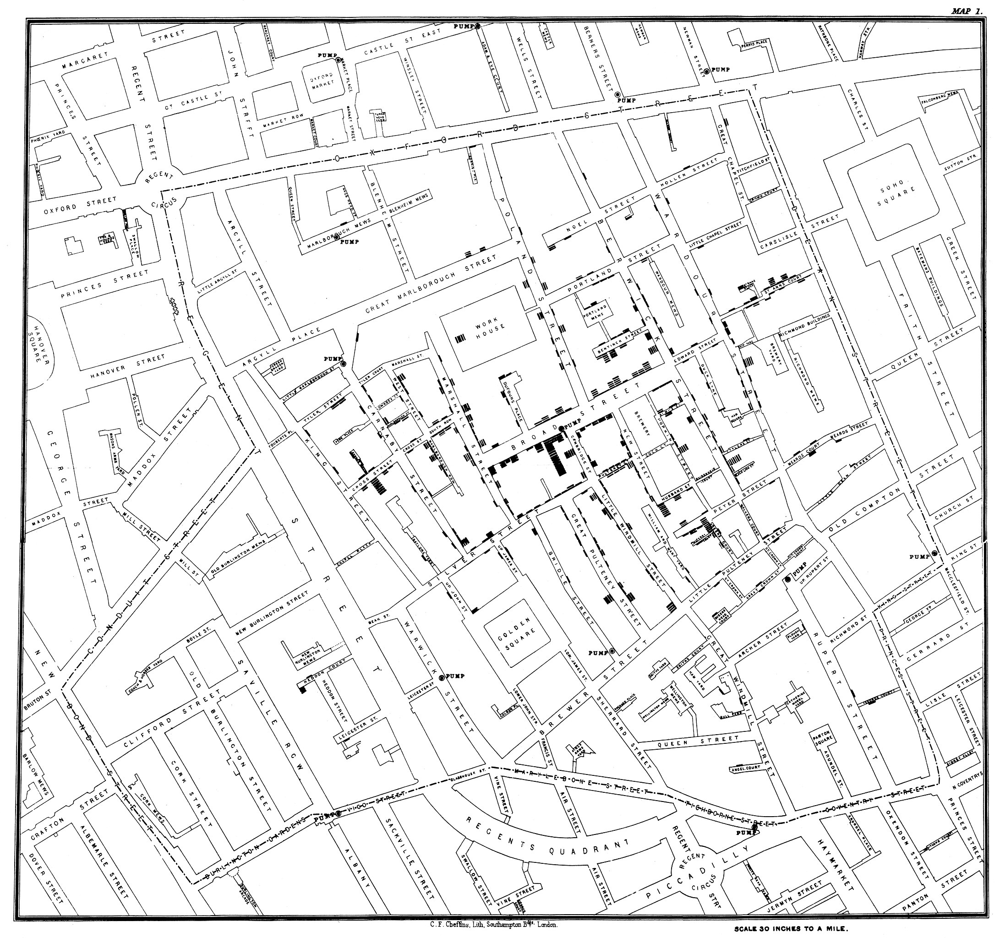
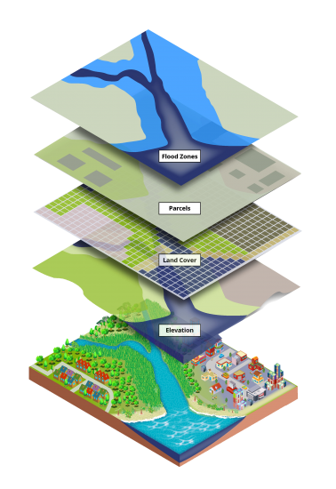
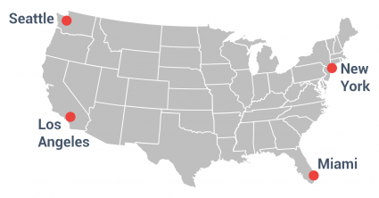

#

[Class survey](https://docs.google.com/forms/d/e/1FAIpQLSe8saqYC_6w76BxhuH1_9bQ_Xma00U11bFq37JsrovmqDeJ6g/viewform?usp=sharing)

#

Apollo 17 in December 1972

#

#

#

What is a map?

#

Why maps?

#

What can maps do?

#

## Week 1 

<xl>
Introduction to GIS 
</xl>

GISの世界へようこそ

## First, let's get Padlet!

## Find your Latitude/Longitude coordinates

1. go to https://maps.google.com
1. zoom to your hometown (生まれた場所)
1. right click!
1. copy the coordinates
1. enter it in the class roster [google sheet](https://docs.google.com/spreadsheets/d/1ux1_jRJgaXThIAX90r9DnRreO63oMGrVuWuH9ABLLhI/edit?usp=sharing)

## Hello!

Call me "Yoh"

In this class, we will call each other by first name 😙

## Your turn! | あなたの番

 

- your latitude and longitude (緯度・経度)
- your <plum>first</plum> name 
- your <plum>passion</plum>
- what <plum>topics</plum> are you interested in for this class?

# Schedule スケジュール

## 

Week | Topic 
--|:--
Week 1 | オリエンテーション, GitHub
Week 2 | 2024 International Humanitarian Mapathon
Week 3 | 環境設定：VS Code
Week 4 | Web Mapping bootcamp 

###

Week | Topic
--|:--
Week 5 | Mapping ① Points and basemaps
Week 6 | Mapping ② Joins and choropleth maps
Week 7 | Mapping ③ Case study: Mapping crime
Week 8 | Group work 

###

Week | Topic
--|:--
Week 9 | Midterm Presentations

###
Week | Topic
--|:--
Week 10 | Mapping ④ Map design
Week 11 | Mapping ⑤ Census Data 1
Week 12 | Mapping ⑥ Census Data 2
Week 13 | Mapping ⑦ Mapping change over time

###
Week | Topic
--|:--
Week 14 | Group work
Week 15 | Final Presentation 

#

<xl>
そもそもGISとは？
</xl>
 

<small>Images from: https://gisgeography.com/what-is-gis/</small>

##

##
<xl>
Layers
</xl>

##

##

How do you visualize data on a map?

##

###

<xl>
What do you see on the map?
</xl>

##

##

##

### 

https://maps.gsi.go.jp/

# VS Code

For this class, all assignments will be created in VSCode

#

### インストールしよう

https://code.visualstudio.com/

#

#

<xl>

地図を作ろう

</xl>

## Use kepler to map all your classmates

1. download the class [google sheet](https://docs.google.com/spreadsheets/d/1ux1_jRJgaXThIAX90r9DnRreO63oMGrVuWuH9ABLLhI/edit?usp=sharing) as a csv file
1. go to http://kepler.gl
1. map your classmates!

 
あえてやり方を教えません 
隣の人と相談しながらカッコイイ地図を作ってね！

## 今週の課題

1. Open Street Map (OSM)って何かを調べる
1. HOTOSMって何か調べる
1. https://learnosm.org/ja/beginner/start-osm/ を参考にOSMアカウントを作る
1. UNIPAで課題提出
