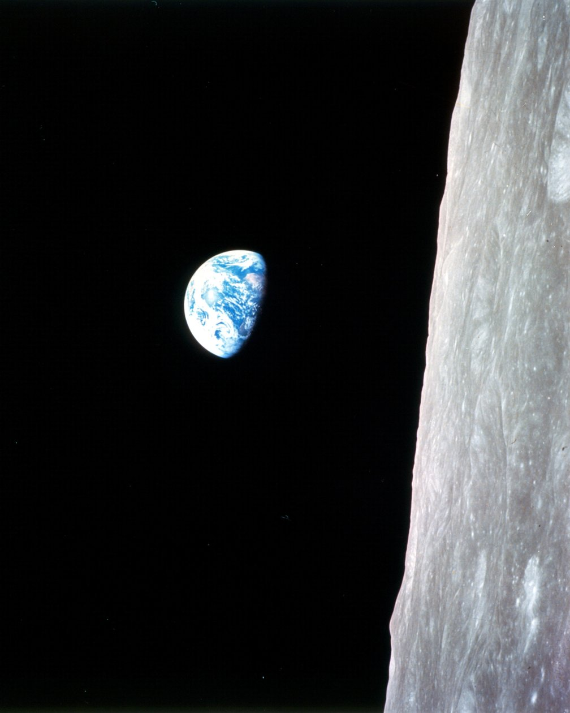
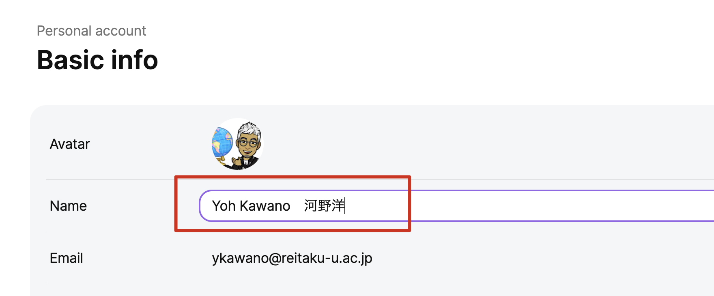
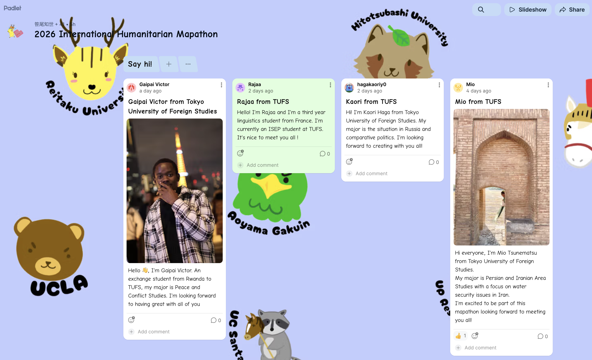
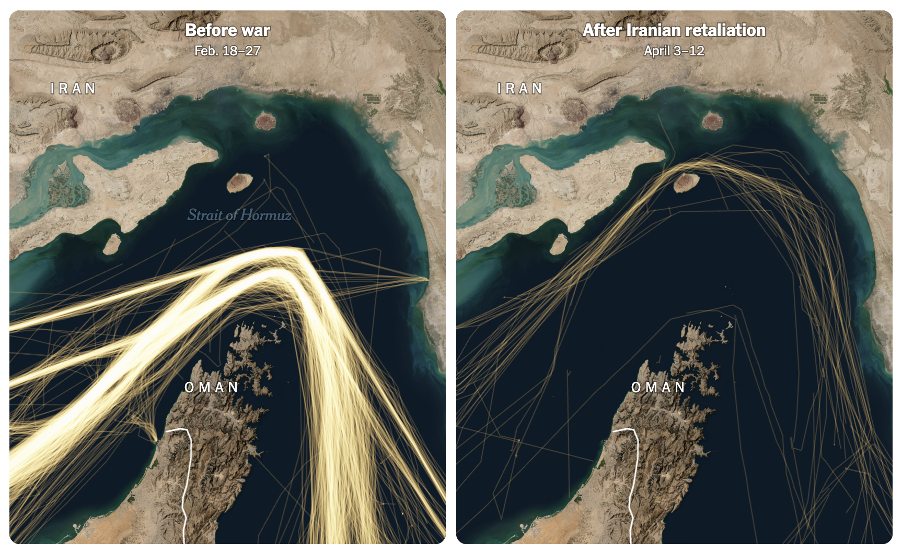
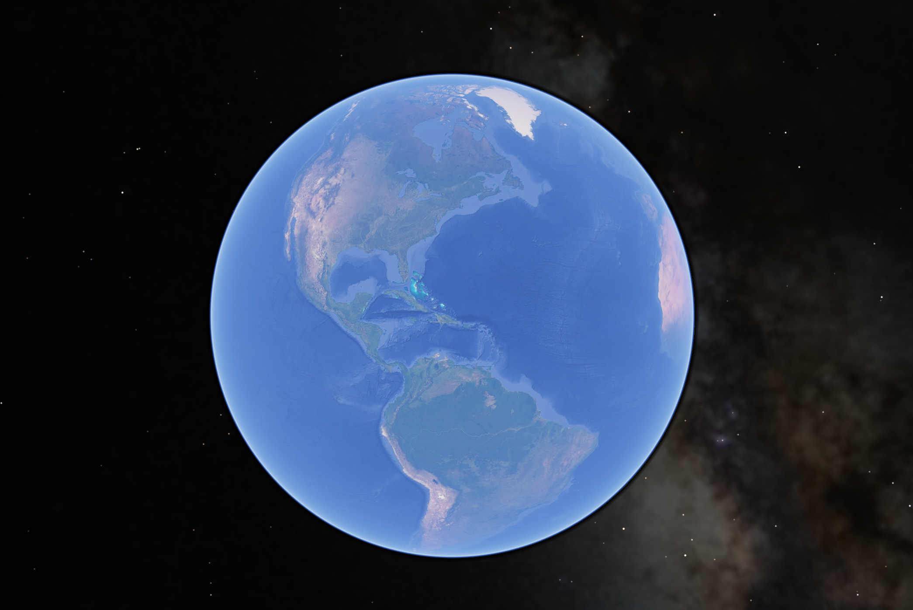
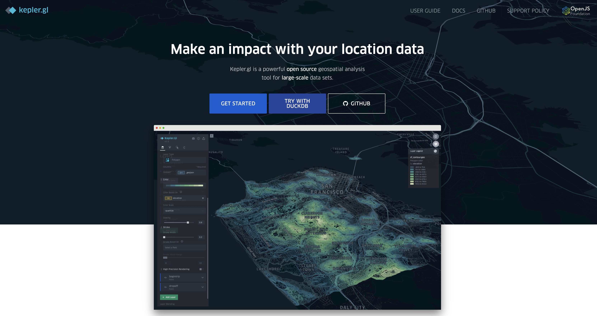
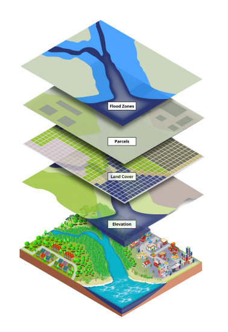
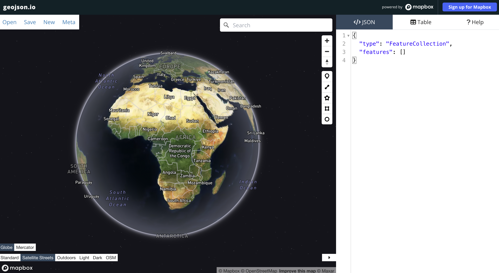

#
  
  

# The Blue Marble

Apollo 17 in December 1972

#

# Earthrise
Apollo 8, December 24, 1968

#
“We came all this way to explore the Moon, and the most important thing we discovered was the Earth.” — William Anders

#

<!-- hello world from artemis II -->

             
https://www.nasa.gov/image-article/hello-world/

# Hello, World
Artemis II, April 2, 2026

#

Padlet

#

大学のメールアドレスで無料版を登録

#

ローマ字と漢字の両方で入力

#

<h1 align="center">🌏 パドレットに自己紹介を投稿しよう！🌏</h1>

https://padlet.com/tsasao/2026-international-humanitarian-mapathon-9wu45lb9w1ctx1w4?lang=en

## 

Call me <large>Yoh</large>

In this class, we will call each other by <medium>first name 😙</medium>

# syllabus

[syllabus](<../../gis syllabus.pdf>)

#

NY Times

# Google Earth

#

https://earth.google.com/

# kepler.gl

#

https://kepler.gl/

##
<xl>
Layers
</xl>

##

##

GISは<large>「ベースマップ」</large>から

##

#

https://maps.gsi.go.jp/

