<style>
    small {font-size:0.8em}
    medium {font-size:1.6em}
    large {font-size:3.5em}
    xlarge {font-size:4em}
    gray {padding:20px;background-color:whitesmoke;font-weight:1200;line-height:2.5}
    red {color:red;font-weight:500;}
    plum {padding:10px;background-color:plum;line-height:3;font-weight:300; font-size:1.5em}
    t1 { font-size:4em;font-weight:100;line-height:1}
    xl { font-size:2.5em;font-weight:100;line-height:1}
    h2 { font-size:2.5em;font-weight:300;line-height:1}
    xls { font-size:1.5em;font-weight:100;line-height:1}
    h1,h2,h3,h4,h5{}
    section {font-size:2em;font-weight:300;}
    left {text-align:left;}
    latex {font-size:2em;color:#444;line-height:1;font-weight:lighter}
    
    hr {background-color:gray;width:80%;margin-top:40px;margin-bottom:40px;}
    
    .small {font-size:0.6em}
    .large {font-size:2em}
    .gray {padding:20px;background-color:whitesmoke;}
    .plum {padding:15px;background-color:plum;}
    </style>
    


## VSCode and GitHub


##

インストールする

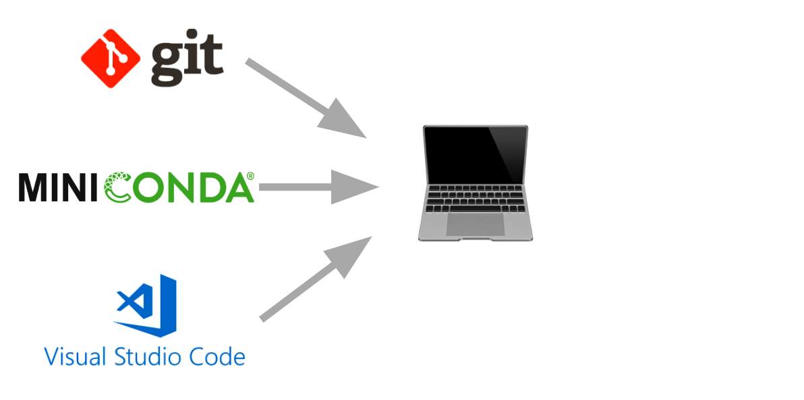

##

アカウントを作る

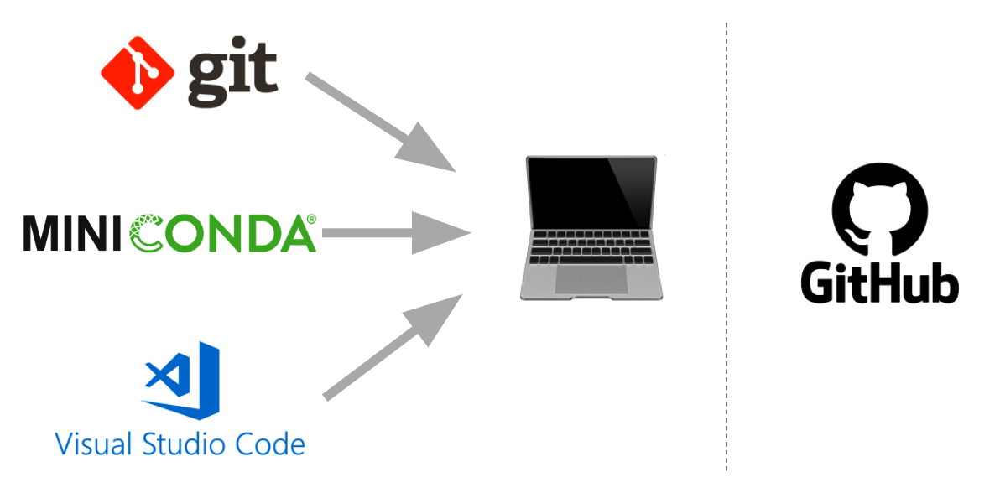

##

クローンする

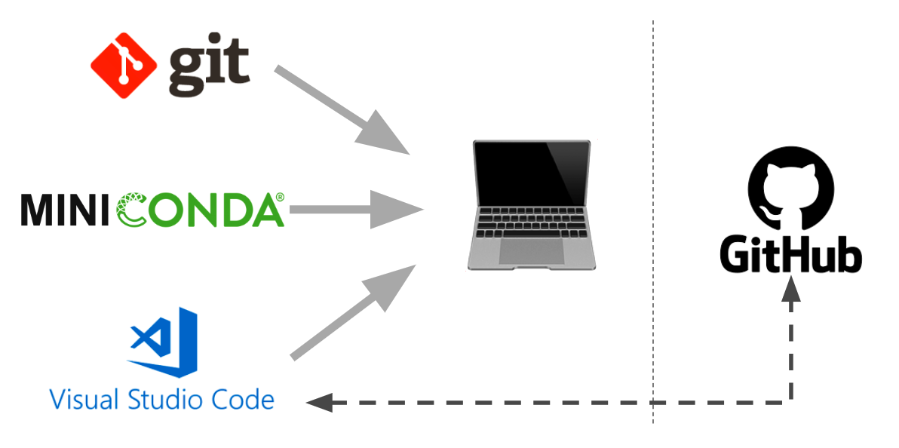

#


##

https://git-scm.com/downloads

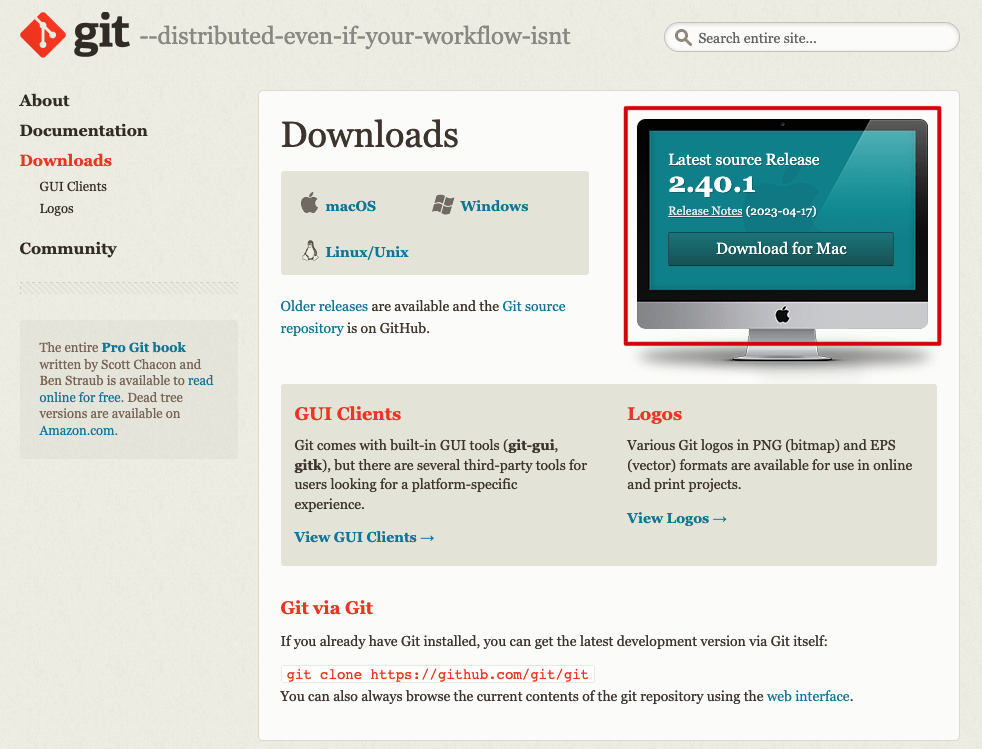

## 全てデフォルトの設定で進んでインストール

<hr>

<medium>☞</medium> アプリではないので、インストールしたらそれでおしまい

#


### インストールしよう

https://code.visualstudio.com/

##

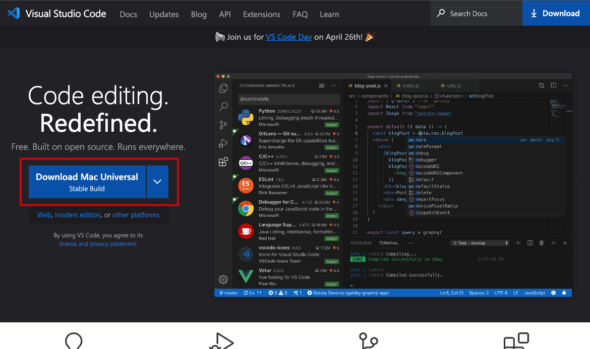

# 


アカウントを作ってクラスの「gis」repo(リポジトリ)を作成

<medium>☞</medium> 先週すでに作った人は22pまでスキップ
## 

http://github.com

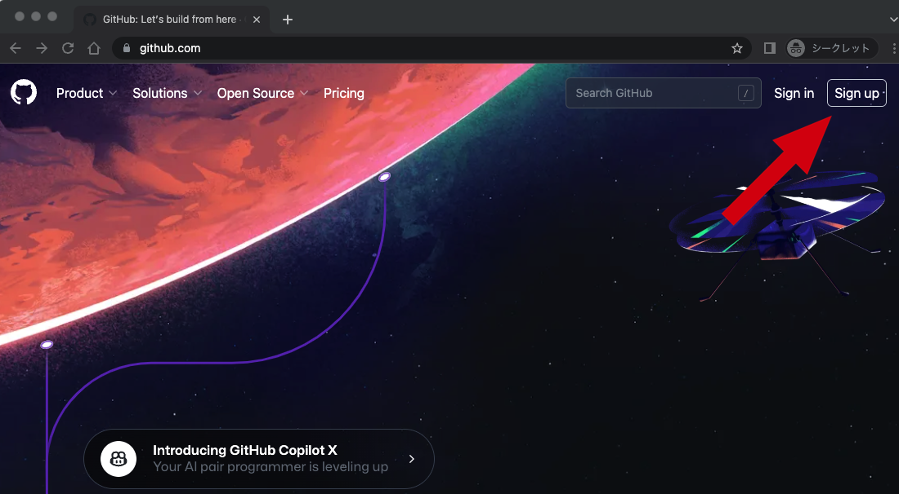

## 

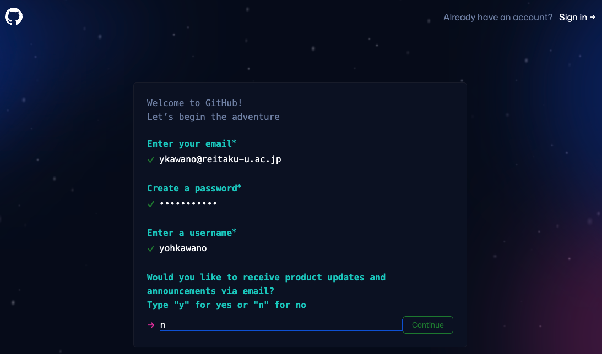

## 


## 


## 

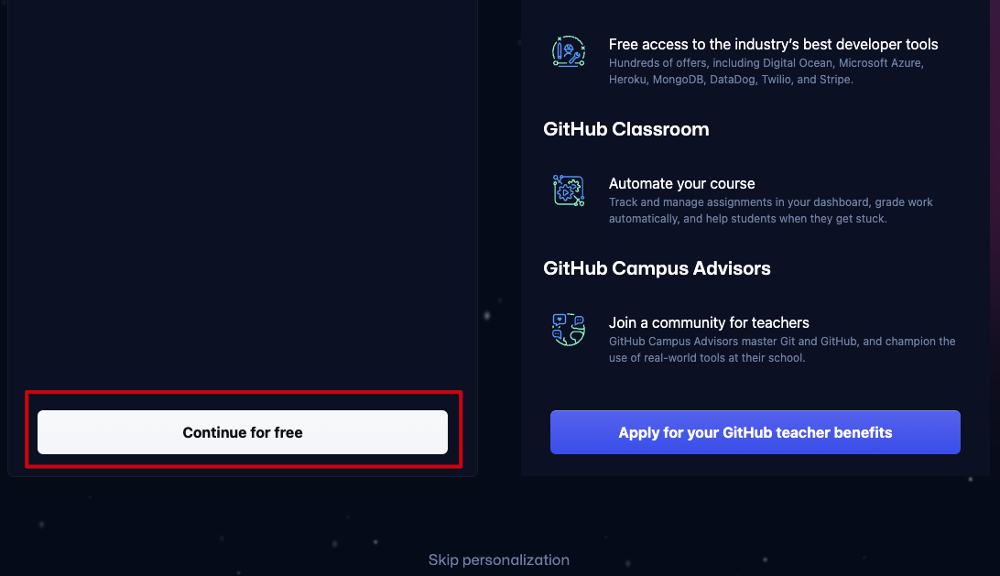

## 

アカウントを確認し、ログインできたら<plum>リポジトリ</plum>を作ろう

##


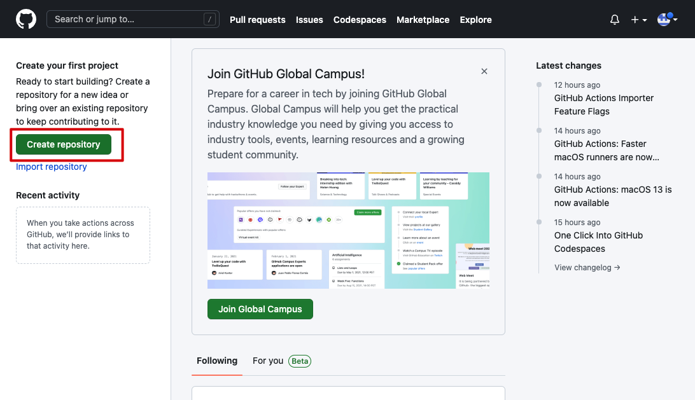

## 

<plum>gis</plum>と名付けよう

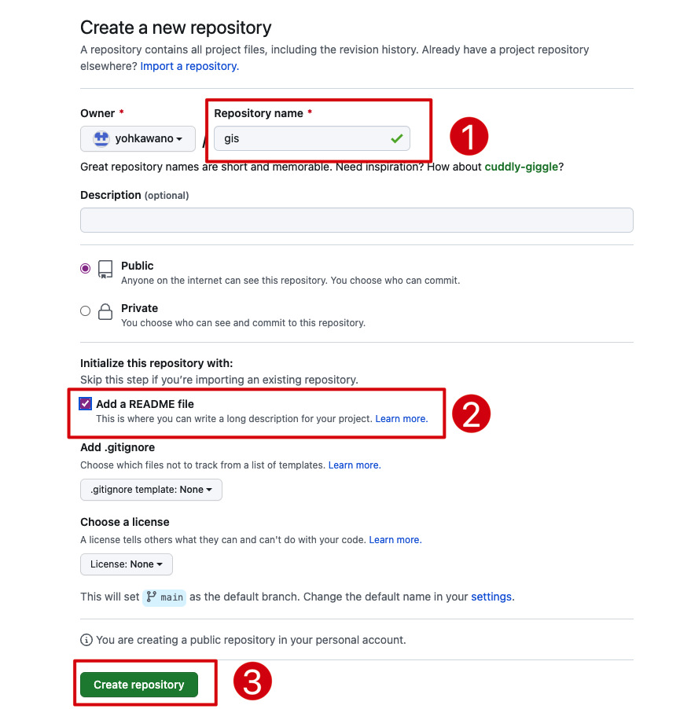

# リポジトリをGitHubから<br>VSCodeに<plum>クローン</plum>しよう

##


## 
GitHubでリポジトリのリンクをコピー

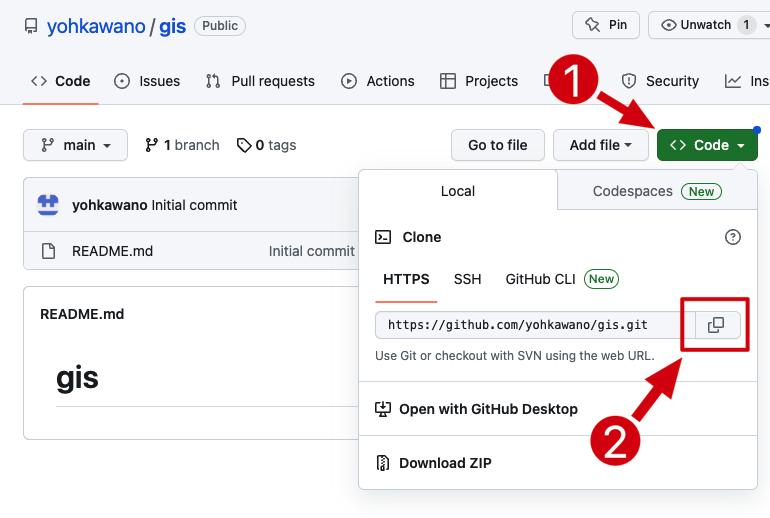

## 

VSCodeでリポジトリをクローン（コピー）する

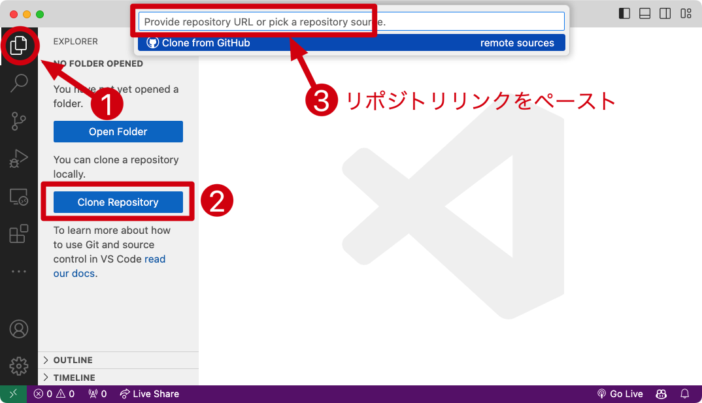

## 

自分のパソコンの覚えやすいところに保存

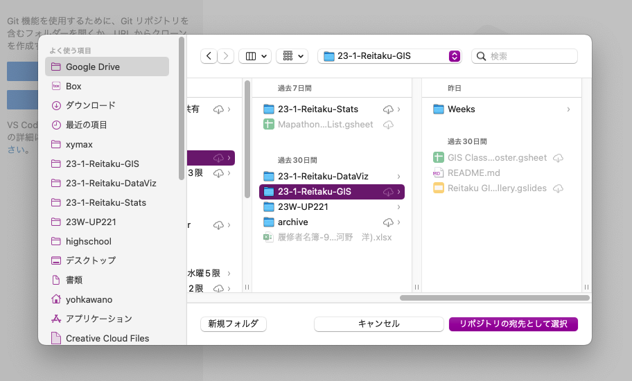

## 

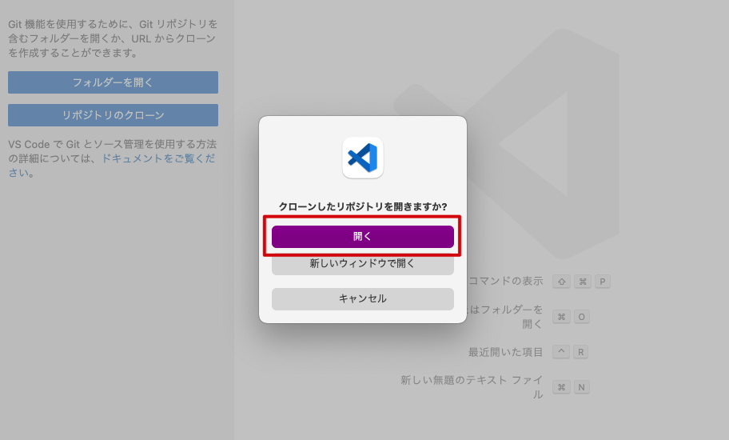

## 

README.md　ファイルを編集しよう

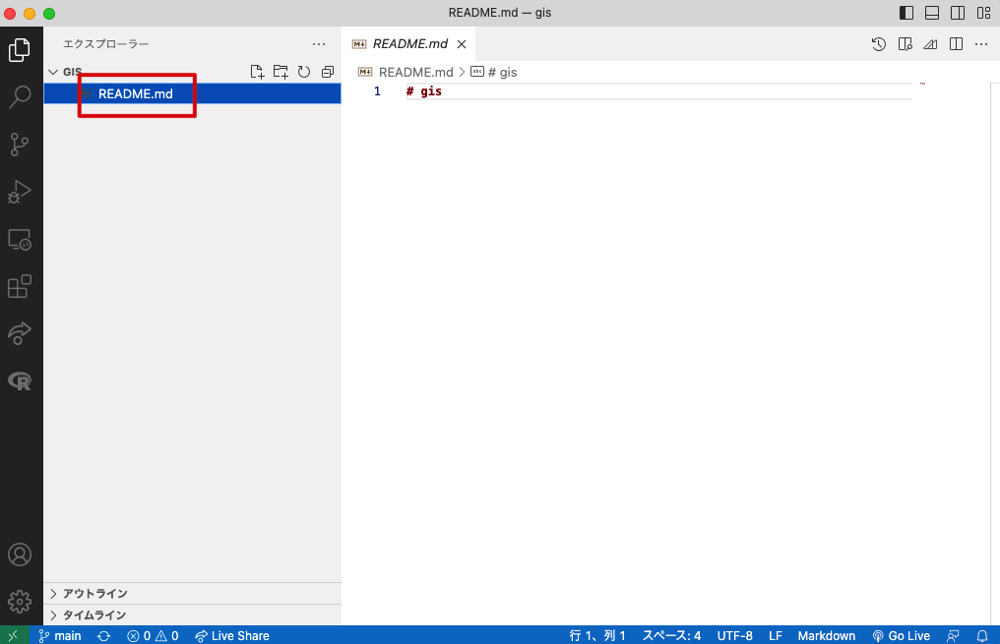

##

Markdownで自己紹介


##

え？Markdownって何？

グーグルで検索！

例えば：

https://notepm.jp/help/how-to-markdown

##

自分の写真を載せよう

##

imagesフォルダーを作成


##

自分の写真をimagesに入れる


## 

Markdownで写真を載せる
```

```


##

GitHubに<plum>コミット</plum>しよう

## その前にVSCodeの設定を管理
<medium>☞</medium> 初期設定なので一回やればもうやらなくていい

##

VSCodeの中でTerminalを立ち上げる


##

あなたのusernameで次のコマンドを打ち込む

```
git config --global user.name "yohman"
```


##

あなたのemailで次のコマンドを打ち込む

```
git config --global user.email "ykawano@reitaku-u.ac.jp"
```


##

README.mdファイルをセーブした後…

##

1. 「ソース管理」タブをクリック
1. 「変更」の隣のプラスボタンをクリック

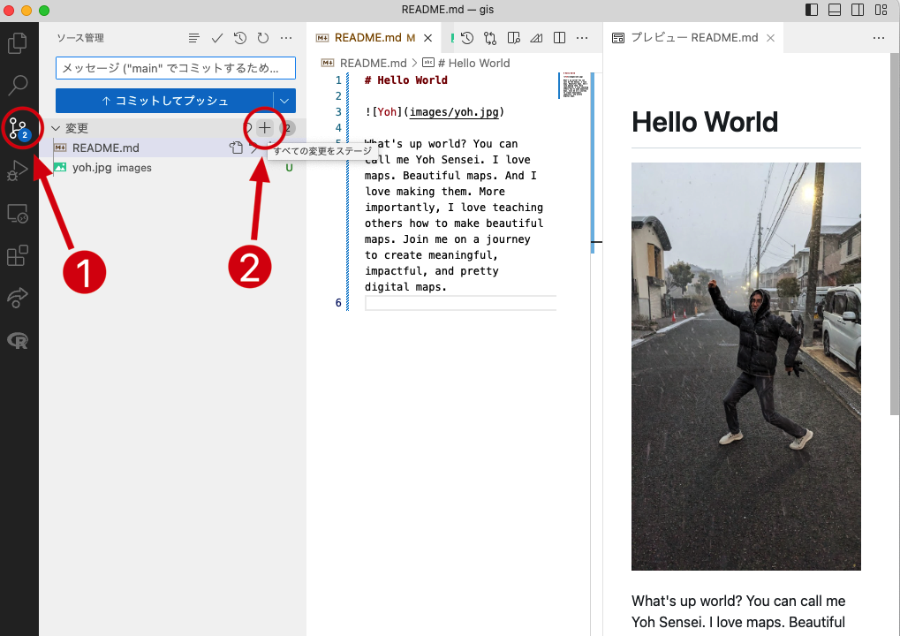

##

「ステージされている変更」にファイルが入っていることを確認

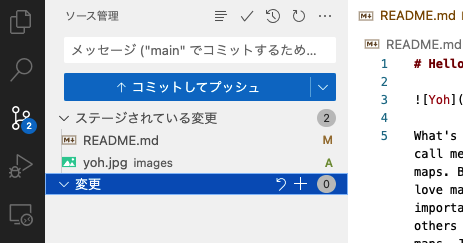

##

1. コメントを記入（とりあえず「First commit」と入力）
1. 「コミットしてプッシュボタン」をクリック


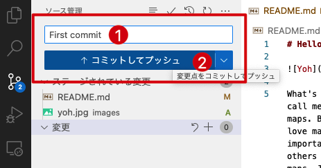


##

😫　エラーがある　➽　多半数
<hr>

👽　エラーがない　➽　あなたは天才

##

エラーがなければGitHubページに戻ってrefresh!


##

エラーがあれば一緒に解決しましょう

## 今週の課題: Map Review

<small>

- create a `week02` 📁 folder in your repo
- create a new 📄 file in the `week02` folder and name it `week2homework.md`
- find a 🗺️ map that interests you
    - it can be a printed map, like on a magazine
    - it can be on the internet
- take a photo or screenshot of the map and add the image and url link to your repo
- add the image to your `week2homework.md` file
- write a review of the map
    - why did you choose this map?
    - what does the map show?
    - what do you like about it and what do you not like about it?

</small>

## 

- リポジトリに `week02` 📁 フォルダーを作成
- `week02` フォルダーの中に新しい 📄 ファイルを作成し、「week2宿題.md」という名前を付ける。
- 興味のある 🗺️ 地図を見つける
     - 雑誌のような印刷された地図でも構いません
     - インターネット上でも構いません
- マップの写真またはスクリーンショットを撮り、画像と URL リンクをリポジトリに追加
- 画像を`week2homework.md`ファイルに追加
- マップのレビューを書く
     - なぜこのマップを選んだの？
     - 地図は何を示していますか?
     - 何が好きで、何が嫌いですか?