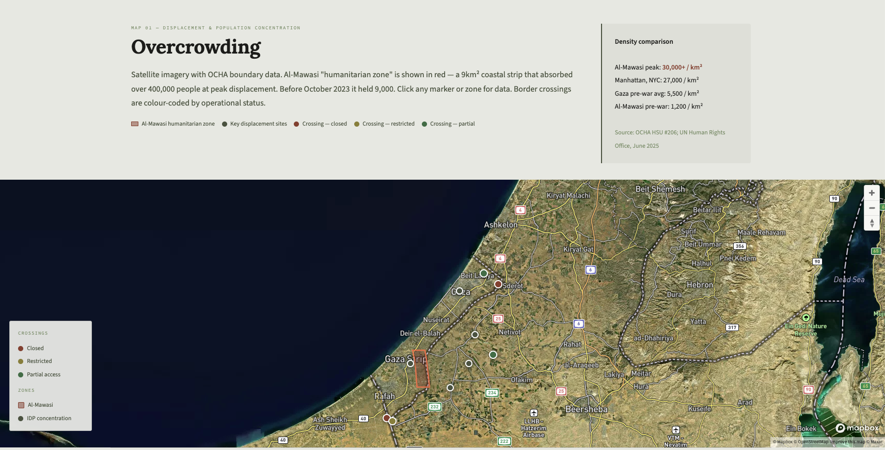
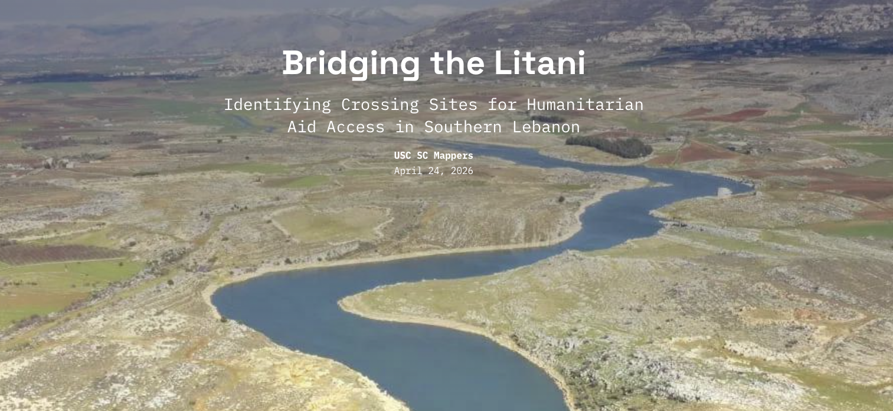
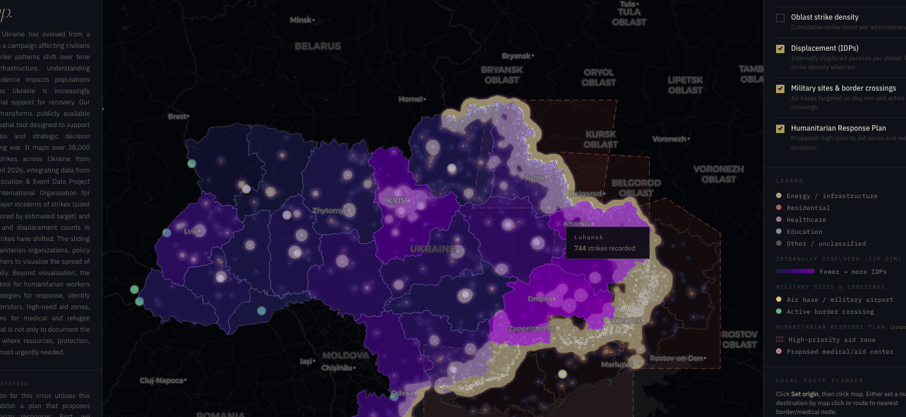
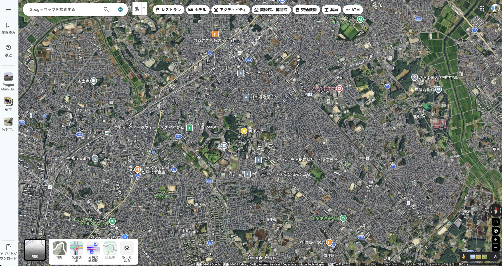
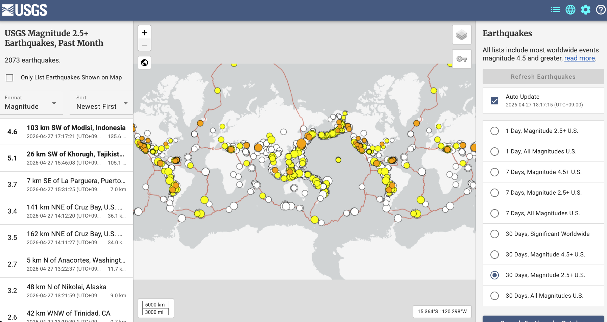

#

Mapathon!

#

https://gazacrisismap.netlify.app/

#

https://storymaps.arcgis.com/stories/8fe291a3fb054f85b30ee1ba95951565

#

https://claragwei.github.io/ukraine-strikes/

#

#
USGS Earthquake Map
https://earthquake.usgs.gov/earthquakes/map/

#

kepler.gl
https://kepler.gl/