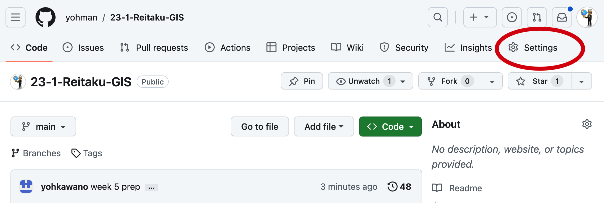
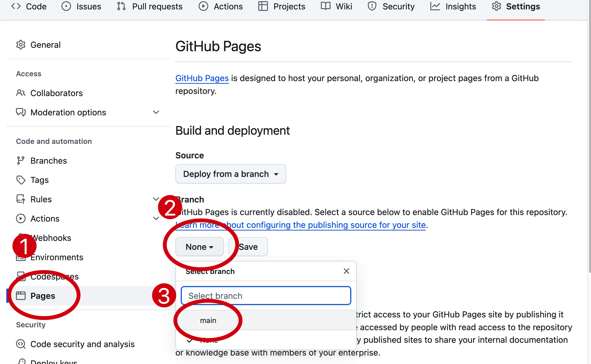
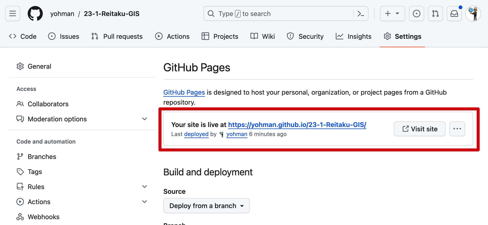
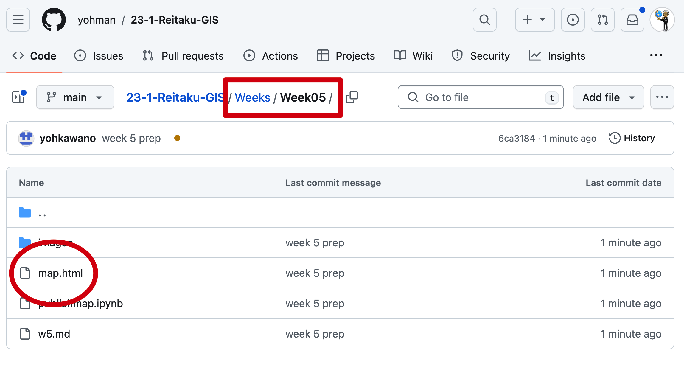

<style>
small {font-size:0.8em}
medium {font-size:1.4em}
large {font-size:3.5em}
xlarge {font-size:4em}
gray {padding:20px;background-color:whitesmoke;font-weight:800;line-height:2.5}
red {color:red;font-weight:500;}
plum {padding:20px;background-color:plum;line-height:3;font-weight:800}
t1 { font-size:4em;font-weight:100;line-height:1}
xl { font-size:2.5em;font-weight:100;line-height:1}
xls { font-size:1.5em;font-weight:100;line-height:1}
h1,h2,h3,h4,h5{}
section {font-size:2em;font-weight:300;}
left {text-align:left;}
latex {font-size:2em;color:#444;line-height:1;font-weight:lighter}

.small {font-size:0.6em}
.large {font-size:2em}
.gray {padding:20px;background-color:whitesmoke;}
.plum {padding:20px;background-color:plum;}
hr{ border:1px dashed #ccc;width:90%;margin-bottom:40px}
</style>


## Week 5

<xl>
Publishing your Web Map
</xl>

<br>
GISの世界へようこそ


## Set up "Pages" on GitHub

<hr>

1. Go to your GitHub GIS repository
1. Click on "Settings"

## 

<hr>

1. Click on `pages`
1. Under `Branch` click on the `None` dropdown
1. Select `main`
1. Click on `save`

##

<hr>

1. Go to `Actions`
1. Wait for yellow circle 🟡 to turn to green 🟢

##


<hr>

1. Go back to `Settings`/`Pages`
1. Note the URL for your GitHub account

## Open VSCode

1. Open the notebook with the folium map you want to publish
1. Make sure the map is in a variable (in the map below, the map variable is `m`)

```python
# import folium, a leaflet python library
import folium

# create a list of lat/lon pair for UCLA
reitaku = [35.8330, 139.9550]

# make the map
m = folium.Map(location=reitaku, zoom_start=15)

# add a marker
folium.Marker(reitaku, 
              popup="Reitaku University, the best place on earth!", 
              tooltip="Reitaku University").add_to(m)

# show the map
m
```

## 
```python
m.save("map.html")
```

1. Create a new code cell, and add code above
1. Check to make sure the file `map.html` was created
1. Save and commit to GitHub

##

<hr>

1. Go to your GitHub account, and find `map.html`
1. Construct the URL for your map. Should be something like:

`yohman.github.io/gis/Weeks/Weeks05/map.html`