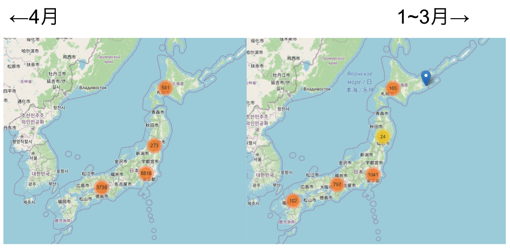
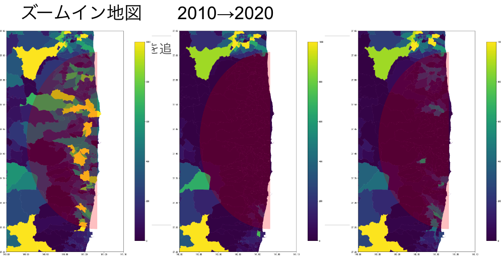
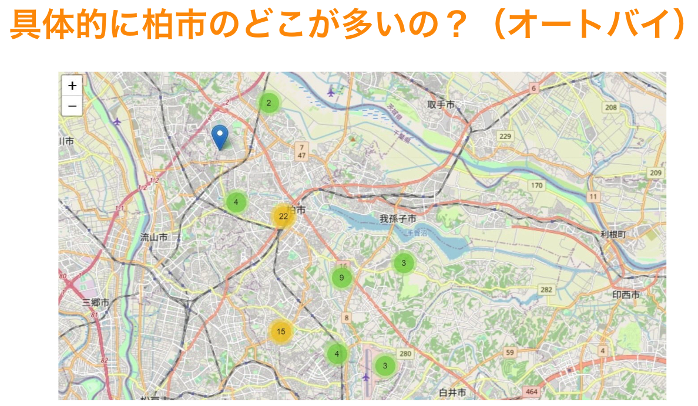
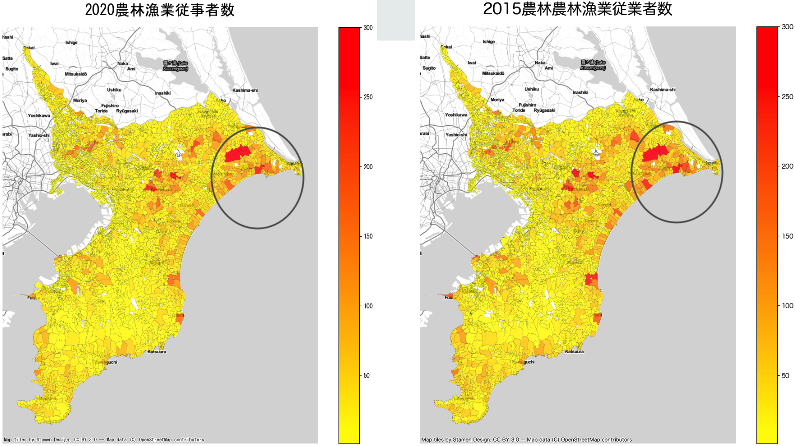
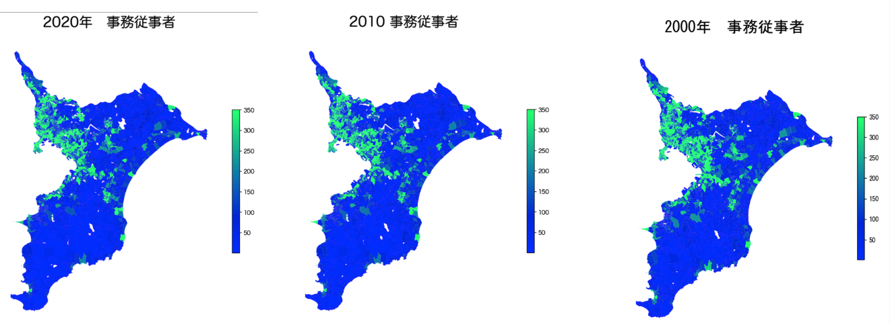
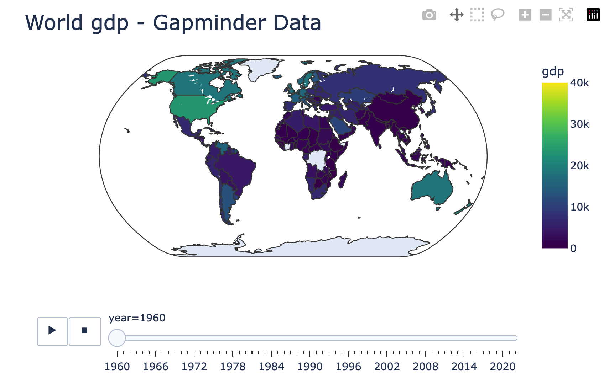

# 2023 Reitaku University Final GIS Projects

## 東京都・大阪府 外国人人口推移と考察
*Akari Miura, Chikashi Hoshino*

[slides](https://docs.google.com/presentation/d/1_A0hhu6WzxQHoB9TRY961lRIm3dt3Rc9Xe-Qabzv13M/edit#slide=id.p)

## コロナウイルスのクラスターマップ
*Kazu, Yuduki*

[slides](https://docs.google.com/presentation/d/1COy4ZQyidK9cVzOnDPiW6BAaVO2H32L9n_mVNvawPgo/edit#slide=id.p)
## Where The People Disappeared
*Kuya, Naruse*

[slides](https://classroom.google.com/g/tg/NTE2Mjc2OTMxMjIw/NjE2NjkyNDkyMjU2#u=MzEyNDg4MTE4MjU1&t=f)

# 千葉県の自動車盗難って多いの？
*Issa, Hibiki, Akira*

[slides](https://docs.google.com/presentation/d/1ZxffA1jj0JziBX85l8PJs1T8XRHUdhzd-pORjntwMek/edit#slide=id.p)

# 千葉県従業者数比較 2015~2020
*Haruto, Kazuma, Yuuki*

[slides](https://drive.google.com/file/d/1qZJYzVEQ1n72LD3ipNlSYJdk09LhUwgc/view)
# 千葉県の事務職は減少しているのか？

Saba, Kasumi, Yuki

[slides](https://docs.google.com/presentation/d/1WF8JI_yqNcsNAlZ8-07J6v9Xm7QG4RC5A2tl4N6Zhg8/edit#slide=id.p)
# World Happiness
*Naoki*

