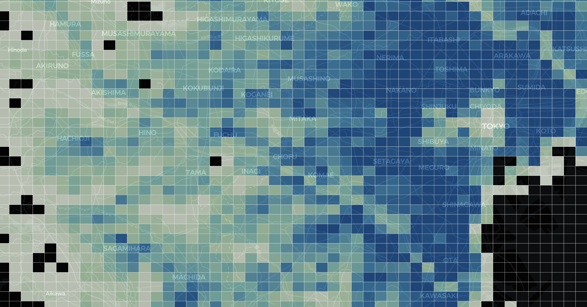

# 1kmメッシュの統計データを地図に可視化する

このワークショップでは、e-Statから東京23区の1kmメッシュのポリゴンと統計データをダウンロードし、GeoJSONに変換してMapLibre上で階級区分図（Choropleth Map）として表示する方法を学びます。


---

## ステップ1：ポリゴンデータ（メッシュ境界）をダウンロード

まず、地図の基本となるポリゴンデータ（メッシュの境界線）をe-Statからダウンロードします。このデータは、地図上に統計情報を表示するための区画を定義するために使用されます。

1. [e-Stat](https://www.e-stat.go.jp/) にアクセス
2. メニューから「地図」＞「境界データダウンロード」をクリック
3. 「3次メッシュ（1kmメッシュ）」を選択
4. 世界測地系緯度経度・Shapefileを選び、**M5339（東京都区部）** をダウンロード

---
## ステップ2：ShapefileをGeoJSONに変換

ダウンロードしたShapefile形式のポリゴンデータを、MapLibreで利用できるGeoJSON形式に変換します。Mapshaperを使うと、簡単に変換できます。

1. [Mapshaper](https://mapshaper.org/) にアクセス  
2. 前のステップでダウンロードしたzipファイルをアップロード  
3. 右側の「Export」ボタンをクリックし、「GeoJSON」を選択  
4. 出力ファイル名を「tokyo_mesh.geojson」に指定し、拡張子を .json から .geojson に変更してエクスポート

---

## ステップ3：統計データ（人口など）をダウンロード

次に、地図上に表示する統計データ（例：人口）をe-Statからダウンロードします。このデータは、各メッシュのポリゴンに対応する形で提供されており、地図の色分けに使用されます。

1. [e-Stat](https://www.e-stat.go.jp/) にアクセス
2. メニューから「地図」＞「統計データダウンロード」をクリック
3. 「国勢調査」を選択
4. 「2020年」を選択
5. 「3次メッシュ（1kmメッシュ）」を選択
6. 「人口及び世帯　（JGD2000）」を選択
7. **M5339（東京都区部）** を選び、「CSV」をダウンロード
8. ダウンロードしたファイルを展開し、「tblT001100S5339.txt」として保存

---

## ステップ4：Google Colabでデータを読み込む

新しいタブで[Google Colab](https://colab.research.google.com/)を開き、以下のコードを実行して必要なライブラリをインストールし、GeoJSON（tokyo_mesh.geojson）と統計データ（tblT001100S5339.txt）を読み込みます。

> ⚠️ **注意！**  
> Google Colabでは、ファイルをアップロードする必要があります。以下のコードを実行すると、ファイルをアップロードするためのダイアログが表示されます。
>
> ⚠️ **注意2！**  
> アップロードするファイルは、`tokyo_mesh.geojson` と `tblT001100S5339.txt` の2つです。ファイル名が異なる場合は、コード内のファイル名を適宜変更してください。

```python
!pip install geopandas
from google.colab import files
uploaded = files.upload()  # tokyo_mesh.geojson と tblT001100S5339.txt をアップロード

import geopandas as gpd
import pandas as pd

# GeoJSON 読み込み
gdf = gpd.read_file("tokyo_mesh.geojson")

# 統計データ（txt）読み込み
df = pd.read_csv("tblT001100S5339.txt", encoding="shift-jis", skiprows=[1])
```

> ⚠️ **注意！**  
> `tblT001100S5339.txt`の読み込み時に、`skiprows=[1]`を指定しているのは、最初の行がヘッダーではないためです。必要に応じて調整してください。

## ステップ5：GeoJSONと統計データの結合
GeoJSONデータと統計データを結合します。ここでは、`KEY_CODE`という共通のキーを使って結合します。`KEY_CODE`は、メッシュの識別子であり、GeoJSONと統計データの両方に存在します。`merge`関数を使用して、これらのデータフレームを結合します。

```python
# Convert 'KEY_CODE' column to integer type in both dataframes
gdf['KEY_CODE'] = gdf['KEY_CODE'].astype(int)
df['KEY_CODE'] = df['KEY_CODE'].astype(int)

# Join on KEY_CODE
merged = gdf.merge(df, on="KEY_CODE", how="left")
```

---

## ステップ6：合計人口フィールドで Choropleth を表示

結合されたデータを使って、人口に応じた色分け地図（Choropleth Map）を作成します。`matplotlib`ライブラリを使用し、人口データを色で表現し、地図上に表示します。

```python
import matplotlib.pyplot as plt

# Make the plot larger
fig, ax = plt.subplots(1, 1, figsize=(15, 10))

# Create a choropleth map
merged.plot(column='T001100001', ax=ax, legend=True,
            legend_kwds={'label': "Total Population",
                         'orientation': "horizontal"})

# Add a title (optional)
ax.set_title('Choropleth Map of Total Population')

# Display the plot
plt.show()
```

---

## ステップ7：GeoJSONにエクスポート

色分けされた地図データをGeoJSON形式でエクスポートします。このGeoJSONファイルは、MapLibreで表示するために使用されます。

```python
merged.to_file("tokyo_population.geojson", driver="GeoJSON")
files.download("tokyo_population.geojson")
```

---

## ステップ8：MapLibreで表示する

最後に、エクスポートしたGeoJSONファイルをMapLibreで表示します。`index.html`ファイルを作成し、MapLibreの設定を記述することで、インタラクティブな地図として表示できます。

```html
<!DOCTYPE html>
<html>
	<head>
		<meta charset="utf-8" />
		<title>Tokyo 1km Mesh Population Map</title>
		<meta name="viewport" content="initial-scale=1,maximum-scale=1,user-scalable=no" />
		<link
			href="https://unpkg.com/maplibre-gl@2.4.0/dist/maplibre-gl.css"
			rel="stylesheet"
		/>
		<style>
			body {
				margin: 0;
				padding: 0;
			}
			#map {
				width: 100%;
				height: 100vh;
			}
		</style>
	</head>
	<body>
		<div id="map"></div>
		<script src="https://unpkg.com/maplibre-gl@2.4.0/dist/maplibre-gl.js"></script>
		<script>
			const map = new maplibregl.Map({
				container: 'map',
				style: 'https://basemaps.cartocdn.com/gl/dark-matter-gl-style/style.json',
				center: [139.75, 35.68],
				zoom: 9
			});

			map.on('load', () => {
				map.addSource('tokyo', {
					type: 'geojson',
					data: 'tokyo_population.geojson'
				});

				map.addLayer({
					id: 'population-layer',
					type: 'fill',
					source: 'tokyo',
					paint: {
						'fill-color': [
							'interpolate',
							['linear'],
							['get', 'T001100001'],
							0,
							'#f0f9e8',
							5000,
							'#bae4bc',
							10000,
							'#7bccc4',
							15000,
							'#2b8cbe',
							20000,
							'#08589e'
						],
						'fill-opacity': 0.75,
						'fill-outline-color': '#ffffff'
					}
				});
			});
		</script>
	</body>
</html>
```

---

## 応用課題（チャレンジ）

- `fill-color`のブレークポイントを変更して、人口分布の見え方を工夫しよう
- 他の変数（世帯数など）を使って色分けを試してみよう
- ホバー時のポップアップ表示（マウスオーバーで人口などの情報）
- タイトルとサブタイトル（例：「高齢化地域分布図」など）
- ベースマップの切り替え（例：地形図・白地図・航空写真）
- 複数の属性に対応（高齢者数や世帯数）
- レイヤー切替やフィルター、検索バーの追加
- ポップアップに地区名や統計の詳細を表示
- 凡例を追加して、色分けの意味を明示する


