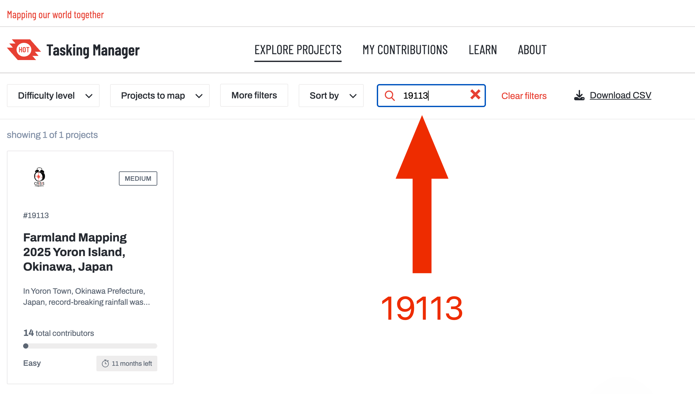
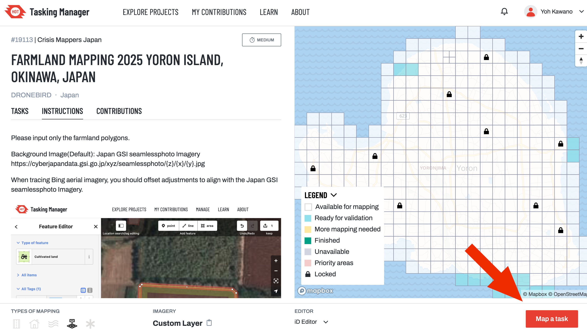
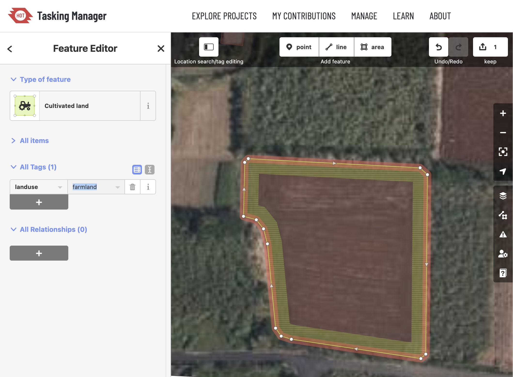

# 🌍 マパソン参加チュートリアル（日本語）

このチュートリアルでは、**OpenStreetMap** のアカウント作成から、**HOTOSM タスキングマネージャー**を使った実際のマッピング作業までの流れを説明します。  
今回のプロジェクトでは、**洪水被害を受けた島の将来の災害対策のために、田んぼ（rice paddies）をポリゴンでマッピングする**ことが目的です。

---

## ✅ 1. OpenStreetMap のアカウントを作成する

1. 以下のURLにアクセス：  
   👉 [https://www.openstreetmap.org/](https://www.openstreetmap.org/)
2. 右上の「サインアップ（Sign Up）」をクリック。
3. ユーザー名、メールアドレス、パスワードを入力してアカウントを作成します。
4. 登録したメールに届く確認リンクをクリックして、アカウントを有効にしてください。

---

## ✅ 2. HOTOSM タスキングマネージャーにログインする

1. 以下のURLにアクセス：  
   👉 [https://tasks.hotosm.org/](https://tasks.hotosm.org/)
2. 右上の「ログイン（Login）」をクリック。
3. 「OpenStreetMap アカウントでログイン（Login with OpenStreetMap）」を選び、先ほど作成したアカウントでログインします。

---

## ✅ 3. プロジェクトを探す

マッピング対象のプロジェクトにアクセスする方法は2通りあります：

### 🔹 方法A：プロジェクトURLに直接アクセス  
以下のリンクをクリック：  
👉 [https://tasks.hotosm.org/projects/19113/](https://tasks.hotosm.org/projects/19113/)

### 🔹 方法B：プロジェクト番号で検索  
1. [https://tasks.hotosm.org/](https://tasks.hotosm.org/) にアクセス  
2. 画面右上の「🔍 Search（検索）」アイコンをクリック  
3. 検索ボックスに `19113` と入力し、エンターキーを押す  
4. 表示されたプロジェクト「**19113 - Farmland Mapping 2025 Yoron Island, Okinawa, Japan**」をクリック

### ⏩ 次のステップ：

- プロジェクトページが開いたら、**「Contribute（貢献する）」→「Map a task（タスクをマッピングする）」** をクリックして作業を始めましょう。

---

## ✅ 4. 実際にマッピングしてみよう

- 画面右側に表示されるエリアから、空いているタイル（マッピング未完了のエリア）を選択してください。
- 選んだタイルの中で、**田んぼ（rice paddies）をポリゴン（多角形）でトレース**します。
- 航空写真や衛星画像を見て、田んぼの区画を丁寧になぞっていきます。
- 編集には、通常「iDエディター（ブラウザ内）」か「JOSM（アプリ）」を使用します。初心者には **iDエディター** がおすすめです。

---

## 🎯 注意ポイント

- このプロジェクトは、**将来の洪水や災害への備え**として、**田んぼの正確な位置と範囲**を記録することが目的です。
- ポリゴンを描いたら、**タグ付け（例：landuse=farmland や crop=rice）**も忘れずに行いましょう。
- 作業が終わったら、「完了」または「保存して次へ」をクリックして、タイルを提出します。

---

## 📢 最後に

みなさんの作業が、現地での支援活動や災害対応に大きく役立ちます。  
**一つ一つのマッピングが、人の命を守ることに繋がっている**ということを、ぜひ意識して取り組んでください。

